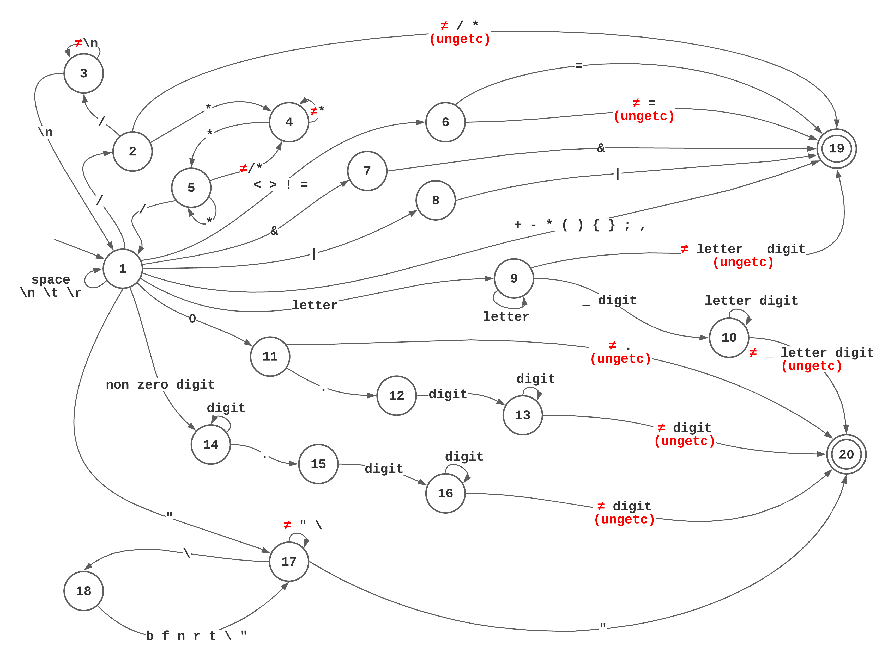

# Compilador

Esse projeto contém um compilador para uma linguagem fictícia, criado como um trabalho para a disciplina de Compiladores do curso de Engenharia de Computação do CEFET-MG.

## Características da linguagem

* As palavras-chave da linguagem são reservadas;
* Toda variável deve ser declarada antes do seu uso;
* A entrada e a saída da linguagem estão limitadas ao teclado e à tela do computador;
* A linguagem possui comentário de uma linha que começam com **//**;
* A linguagem possui comentário de mais de uma linha que começam com **/\*** e termina com **\*/**;
* O operador **+**, quando aplicado a um dado do tipo string, representa concatenação;
* Os demais operadores aritméticos são aplicáveis somente aos tipos numéricos;
* O resultado da divisão entre dois números inteiros é um número real;
* Somente tipos iguais são compatíveis nesta linguagem;
* As operações de comparação resultam em valor lógico (verdadeiro ou falso);
* Nos testes (dos comandos condicionais e de repetição) a expressão a ser validada deve ser um valor lógico;
* A semântica dos demais comandos e expressões é a tradicional de linguagens como Java e C/C++;
* A linguagem é case-sensitive.

Um exemplo é dado a seguir (examples/basic):

```
class Basic
	int a,b,r;

init
	read(a);
	read(b);
	r = a + b;
	write(r);
stop
```
Esse programa lê dois inteiros, e imprime sua soma.

## Implementação do compilador

A implementação do interpretador pode ser dividida em (N) fases):
[analisador léxico](#analisador-léxico),
[analisador sintático](#analisador-sintático),
[gerador de códico](#gerador-de-códico),
[compilador](#compilador).
Cada uma dessas fases será detalhada a seguir.

### Analisador léxico

O analisador léxico é responsável por separar os *tokens* da linguagem.
*Tokens* são os menores elementos que podem ser formados por um programa.
Note que, nessa linguagem, espaços, novas linhas, tabulações e comentários não são elementos léxicos, ou seja, não formam *tokens*.

#### Lexema

O lexema é uma estrutura que carrega um *token* e o tipo desse *token*. Opcionalmente, um lexema pode carregar informações adicionais, porém essas não serão utilizadas no escopo da implementação dessa linguagem.

```cpp
struct Lexeme{
	std::string token;
	enum TokenType type;
	union {
		enum var_type type;
		int int_value;
		float float_value;
	} data;
}
```

O lexema possui seus membros públicos para facilitar sua utilização pelo analisador léxico.
O *token* é uma string com o elemento formado, e *type* é o tipo do *token*.
Os tipos possíveis são listados pela enumeração *TokenType* que inclui símbolos da linguagem (ex.: **+**, **;**, ...), palavras-reservadas (ex.: **if**, **while**, ...), além de alguns tipos especiais (ex.: *token* inválido, constante númerica, ...).

```cpp
enum TokenType {
	// SPECIALS
	TKN_UNEXPECTED_EOF = -2,
	TKN_INVALID_TOKEN = -1,
	TKN_END_OF_FILE = 0,

	// SYMBOLS
	TKN_OPEN_PAR,		// (
	TKN_CLOSE_PAR,		// )
	TKN_OPEN_CUR,		// {
	TKN_CLOSE_CUR,		// }
	TKN_COMMA,			// ,
	TKN_SEMICOLON,		// ;

	// OPERATORS
	TKN_ASSIGN,			// =
	TKN_NOT,			// !
	TKN_EQUAL,			// ==
	TKN_NOT_EQUAL,		// !=
	TKN_LOWER,			// <
	TKN_GREATER,		// >
	TKN_LOWER_EQ,		// <=
	TKN_GREATER_EQ,		// >=
	TKN_ADD,			// +
	TKN_SUB,			// -
	TKN_MUL,			// *
	TKN_DIV,			// /
	TKN_OR,				// ||
	TKN_AND,			// &&

	// KEYWORDS
	TKN_IF,				// if
	TKN_ELSE,			// else
	TKN_DO,				// do
	TKN_WHILE,			// while
	TKN_READ,			// read
	TKN_WRITE,			// write
	TKN_CLASS,			// class
	TKN_INT,			// int
	TKN_FLOAT,			// float
	TKN_STRING,			// string
	TKN_INIT,			// init
	TKN_STOP,			// stop
	
	// OTHERS
	TKN_NUMBER_INT,		// integers
	TKN_NUMBER_FLOAT,	// reals
	TKN_LITERAL_STRING,	// strings
	TKN_ID				// variable
};
```

Os três primeiros são tipos especiais usados para identificar as seguintes situações:
* fim de arquivo inesperado (`TKN_UNEXPECTED_EOF`);
* *token* inválido (`TKN_INVALID_TOKEN`);
* fim de arquivo normal/esperado (`TKN_END_OF_FILE`).
Já os últimos tipos são usados para representar os tipos:
* números inteiros (`TKN_NUMBER_INT`);
* números reais (`TKN_NUMBER_FLOAT`);
* strings (`TKN_LITERAL_STRING`);
* identificadores (`TKN_ID`).
Todos os outros são designados para palavras-reservadas ou símbolos da linguagem.
Para o programa de exemplo, os lexemas obtidos podem ser vistos na seção de [resultado](#resultado).

#### Tabela de Símbolos

A tabela de símbolos (`SymbolTable`) é uma estrutura auxiliar utilizada para facilitar o casamento de um *token* com seu tipo.
A tabela de símbolos é um dicionário que mapeia uma chave (**token**) com seu valor (**TokenType**).
Essa tabela é pré-populada para todas as palavras-reservadas e símbolos da linguagem.

| *Token* | *TokenType*  |
| ------- | -----------  |
| "="     | TKN_ASSIGN   |
| "=="    | TKN_EQUAL    |
| "!="    | TKN_NOT_EQUAL|
| "<"     | TKN_LOWER    |
| ...     | ...          |

Note que não é possível preencher essa tabela com todos os números existentes, nem com todos os possíveis identificadores que possam vir a ser criados por um programa.
Também não deve ser preenchida com os três tipos especiais (`TKN_UNEXPECTED_EOF`, `TKN_INVALID_TOKEN`, `TKN_END_OF_FILE`).
Como a linguagem possui escopo global, uma vez populada essa tabela não será modificada.
Além disso, qualquer consulta a esse mapa cujo *token* não seja encontrado deve retornar o tipo identificador (`TKN_VAR`).

#### Autômato Finito Determinístico

Existem várias estratégias para formação de lexemas.
Na implementação desse interpretador será utilizado um autômato finito determinístico, também conhecido como máquina de estados, conforme diagrama a seguir.



O autômato possui estados (nomeados de 1 a 20) e arestas (rotuladas com símbolos, caracteres do programa).
Existe um único estado inicial - estado 1 - representado pelo estado com uma aresta entrante sem origem, e dois estados finais - estados 19 e 20 - representados pelo círculo duplo.
A transição é dada de um estado x (*e<sub>x</sub>*) para um estado y (*e<sub>y</sub>*) sob um caracter do programa (*'s'*):
*T(e<sub>x</sub>, 's') = e<sub>y</sub>*.
O rótulo `ungetc` é um marcador especial que permite que um símbolo lido seja devolvido ao buffer para que seja lido novamente posteriormente.
Isso é feito pois para encerrar o reconhecimento de alguns lexemas, é necessário ler o próximo símbolo para que seja confirmado. Assim o símbolo que não faz parte do lexema a ser retornado, é devolvido ao buffer.
O analisador léxico implementa esse autômato.

O analisador léxico deve abrir o arquivo de entrada que se deseja compilar.
Deve ser possível *devolver* um caracter para o buffer de leitura.
É usado o descritor `FILE\*` com a função `ungetc` nativa.
Assim, o analisador léxico deve manter:
* um apontador para o número da linha atual (`int m_line;`);
* uma instância com a tabela de símbolos (`SymbolTable m_st;`);
* o descritor do arquivo aberto (`FILE\* m_file;`).

```cpp
class LexicalAnalysis{
	...
	private:
		int m_line;
		SymbolTable m_st;
		FILE* m_file;
};
```

O autômato é implementado no método `nextToken` do analisador léxico.
A cada chamada desse método ativa-se o autômato que retorna próximo lexema do programa de entrada.

```cpp
Lexeme LexicalAnalysis::nextToken(){
	Lexeme lex;
	int state = 1;
	while (state != 19 && state != 20){
		int c = fgetc(m_file);
		switch(state){
			case 1: ...
			case 2: ...
			case 3: ...
			case 4: ...
			case 5: ...
			case 6: ...
			case 7: ...
			case 8: ...
			case 9: ...
			case 10: ...
			case 11: ...
			case 12: ...
			case 13: ...
			case 14: ...
			case 15: ...
			case 16: ...
			case 17: ...
			case 18: ...
			default: // unreacheable
		}
	}

	if(state==19){
		if(!m_st.contains(lex.token))
			m_st.put(lex.token, lex.data.type);
		lex=m_st.get(lex.token);
	}

	return lex;
}
```

O lexema é inicializado vazio, e o autômato é iniciado no estado 1 (`int state = 1;`).
Enquanto não se atinge os estados finais 19 ou 20 (`while (state != 19 && state != 20){`), lê-se um caracter da entrada (`int c = getc();`).
Esse caracter pode ser ou não usado na formação do *token*.
Note que o caracter lido é do tipo inteiro (`int`), já que o fim do arquivo é denotado pelo inteiro `-1`.
Esse inteiro é convertido de volta para caracter ao ser concatenado ao *token*.
Os caminhos que levam ao estado 20 devem anotar explicitamente o tipo do *token* formado, enquanto os caminhos que leval ao estado 19 devem consultar a tabela de símbolos (`lex = m_st.get(lex.token);`).
A implementação de cada transição depende do estado em que a máquina se encontra.

```cpp
case 7:
	if(c=='&'){
		lex.token+=(char)c;
		state = 19;
	}
	else{
		if(c!=EOF)
			ungetc(c, m_file);
		state = 19;
	}
	break;
```

Por exemplo, o caminho e<sub>1</sub>->e<sub>7</sub>->e<sub>19</sub> é usado para formação do *token* **&&**.
No estado 1, ao ler o símbolo *'&'*, ele é adicionado ao *token* e a máquina vai para o estado 7.
A implementação do estado 7 é dada conforme código acima.
Ao ler o símbolo *'&'* (`if(c=='&'){`), ele é incluí-do no *token* (`lex.token += (char)c;`) e a máquina vai para o estado 19 (`state = 19;`).
Note que o diagrama não explicita as transições de erro, mas elas são consideradas na implementação.
Se o programa lê o símbolo *'&'* e chega ao fim do arquivo antes de ler o símbolo *'&'* para a formação do *token* **&&**, é anotado um fim de arquivo inesperado `lex.type = TKN_UNEXPECTED_EOF;` e a máquina vai para o estado 20 (`state = 20;`).
Se o programa lê um caracter qualquer depois do *'&'* que não um *'&'*, é anotado que foi formado um *token* inválido (`lex.type = TKN_INVALID_TOKEN;` e a máquina vai para o estado 20 (`state = 20;`).
Toda transição para o estado 20 tem seu tipo de token explícitamente definido.

Para detalhes da implementação dos outros estados, favor consultar o analisador
léxico disponível no código do repositório.

#### Resultado

O resultado obtido pelo analisador léxico é a sequência de lexemas produzidos
pelo programa de entrada. Para o programa de exemplo, obtêm-se os seguintes
lexemas, nessa ordem:

```
("class", CLASS)
("Basic", IDENTIFIER)
("int", INT)
("a", IDENTIFIER)
(",", COMMA)
("b", IDENTIFIER)
(",", COMMA)
("r", IDENTIFIER)
(";", SEMICOLON)
("init", INIT)
("read", READ)
("(", OPEN_PAR)
("a", IDENTIFIER)
(")", CLOSE_PAR)
(";", SEMICOLON)
("read", READ)
("(", OPEN_PAR)
("b", IDENTIFIER)
(")", CLOSE_PAR)
(";", SEMICOLON)
("r", IDENTIFIER)
("=", ASSIGN)
("a", IDENTIFIER)
("+", ADD)
("b", IDENTIFIER)
(";", SEMICOLON)
("write", WRITE)
("(", OPEN_PAR)
("r", IDENTIFIER)
(")", CLOSE_PAR)
(";", SEMICOLON)
("stop", STOP)
("", END_OF_FILE)
```

Note que ao final do processo obtém-se o lexema `("", TKN_END_OF_FILE)` que é  um marcador que o analisador léxico processou o arquivo de entrada corretamente e chegou a um fim de arquivo sem erros léxicos.

# Agradecimentos:

Doutor @rimsa, professor e inspiração.
Esse trabalho foi desenvolvido usando como base a documentação disponível em https://github.com/rimsa/tiny.